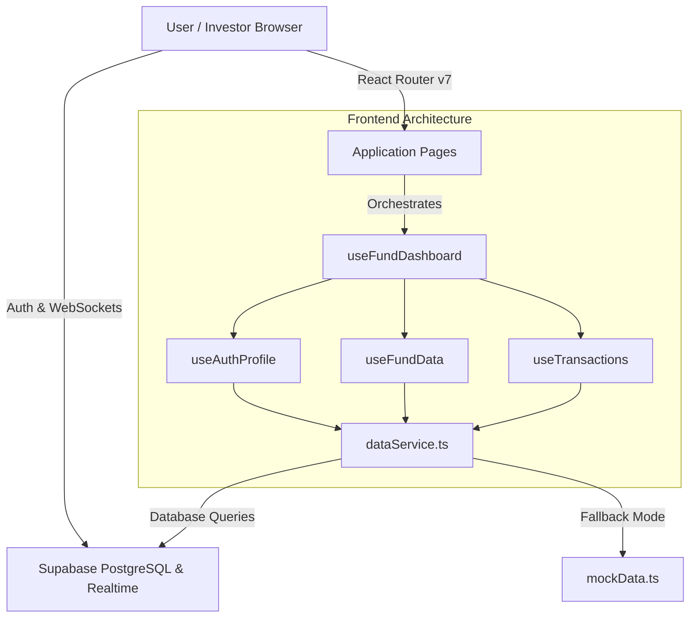

# Apex Syndicate Pool (Fund POC)

A full-stack investment pool dashboard proof-of-concept for syndicate managers (**General Partners**) and participants (**Limited Partners**). Built with **React 19**, **TypeScript**, **Vite**, **Tailwind CSS v4**, **React Router v7**, and **Supabase**.

---

## 📐 Architecture Overview



---

## 🛠️ Technology Stack

| Component | Technology | Description |
| :--- | :--- | :--- |
| **Frontend** | React 19, TypeScript 5.6 | Strict typing & modern hooks |
| **Styling** | Tailwind CSS v4 | Kami editorial theme palette (`#1B365D`, `#F5F4ED`) |
| **Routing** | React Router v7 | Protected route authorization guards |
| **Data Viz** | Recharts, Lucide Icons | Responsive charts & financial UI icons |
| **State** | Modular Custom Hooks | `useAuthProfile`, `useFundData`, `useTransactions` |
| **Backend** | Supabase PostgreSQL | Auth, Row-Level Security (RLS), Realtime WebSockets |
| **Testing** | Vitest, React Testing Library | Unit tests for finance math, services, and error handling |
| **Deployment** | Vercel | Single Page Application (SPA) rewrites via `vercel.json` |

---

## 🚀 Quick Start & Local Development

### 1. Prerequisites
- **Node.js**: `v20+`
- **npm**: `v10+`

### 2. Installation
```bash
# Clone the repository
git clone https://github.com/kai-thelonious/investment-pool-poc.git
cd fund-poc

# Install dependencies
npm install
```

### 3. Environment Variables
Copy `.env.example` to create your local `.env.local` file:
```bash
cp .env.example .env.local
```

Fill in your Supabase project credentials:
```env
VITE_SUPABASE_URL=https://your-project-ref.supabase.co
VITE_SUPABASE_ANON_KEY=your-anon-key-here
VITE_DEMO_PASSWORD=Password123!
```

### 4. Development Commands

| Command | Action |
| :--- | :--- |
| `npm run dev` | Start local Vite development server |
| `npm test` | Run Vitest unit tests |
| `npm run typecheck` | Run strict TypeScript compiler verification (`tsc -b`) |
| `npm run lint` | Run ESLint check |
| `npm run format` | Format codebase with Prettier |
| `npm run build` | Compile production build into `dist/` |
| `npm run db:types` | Regenerate Supabase TypeScript types |

---

## 🛡️ Security & Authorization

- **Row-Level Security (RLS)**: Enforced across all PostgreSQL tables (`profiles`, `transactions`, `fund_history`, `dividends`, `sector_allocation`, `risk_metrics`, `portfolio`).
- **Role-Based Guards**: Protected routes (`/admin`) restrict access strictly to General Partners (`admin` role). Limited Partners (`investor` role) are redirected with permission notices.
- **Role-Based UI Filtering**: Top summary metric cards are automatically hidden when logged in as an LP investor.

---

## 🌐 Production Deployment (Vercel)

The application is pre-configured for **Vercel** deployment via `vercel.json`:

```json
{
  "rewrites": [
    {
      "source": "/(.*)",
      "destination": "/index.html"
    }
  ]
}
```

### Vercel Environment Variables
Set the following under **Project Settings > Environment Variables**:
- `VITE_SUPABASE_URL`
- `VITE_SUPABASE_ANON_KEY`
- `VITE_DEMO_PASSWORD`

---

## 📚 Project Documentation

Detailed technical documentation is available in the [`docs/`](./docs) directory:

- 📖 [**Component Reference (`docs/COMPONENTS.md`)**](./docs/COMPONENTS.md): Detailed props, usage, and component hierarchy.
- 🗄️ [**Supabase Schema & API (`docs/SUPABASE_SCHEMA.md`)**](./docs/SUPABASE_SCHEMA.md): Database schemas, RLS policies, WebSockets, and `dataService.ts` API.
- 📐 [**Architecture Decision Records (`docs/ADR/`)**](./docs/ADR):
  - [ADR-001: Modular Hooks Architecture](./docs/ADR/ADR-001-modular-hooks-architecture.md)
  - [ADR-002: Data Service Fallback Pattern](./docs/ADR/ADR-002-data-service-fallback-pattern.md)
  - [ADR-003: Institutional PE Performance Suite](./docs/ADR/ADR-003-pe-performance-metrics-suite.md)
